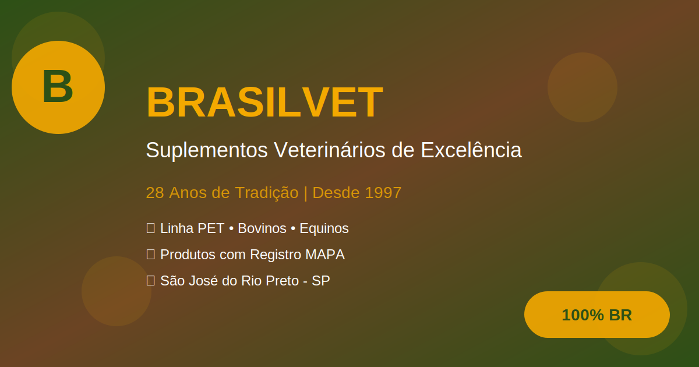

# 🐮 Brasilvet - Suplementos Veterinários

[](https://brasilvet.avilaops.com)
[](LICENSE)
[](https://github.com/avilaops/brasilvet)

## 🌟 Sobre

Site institucional e de vendas da **Brasilvet**, empresa brasileira especializada em suplementos veterinários de alta qualidade, com **28 anos de tradição** (desde 1997).

Oferecemos soluções completas em nutrição animal para:
- 🐕 **Linha PET** - PROBIMAX PET, VITACÃO, FORTOON
- 🐄 **Linha Bovinos** - V.M-SAL PLUS, VITABOV, TRIATACK
- 🐴 **Linha Equinos** - HEMO CELL GOLD, NITROPOWER

## 🚀 Demonstração

**🔗 Site ao vivo:** [brasilvet.avilaops.com](https://brasilvet.avilaops.com)



## 📋 Características

- ✅ **Design Responsivo** - Funciona perfeitamente em desktop, tablet e mobile
- ✅ **Performance Otimizada** - Carregamento rápido e animações suaves
- ✅ **SEO Completo** - Meta tags Open Graph, Twitter Cards e Schema.org
- ✅ **Vídeos Integrados** - Demonstrações visuais dos produtos
- ✅ **Calculadora de ROI** - Ferramenta interativa para cálculo de retorno
- ✅ **Formulário de Contato** - Integrado com WhatsApp
- ✅ **100% Vanilla JavaScript** - Sem dependências de frameworks

## 🛠️ Tecnologias

- **HTML5** - Estrutura semântica
- **CSS3** - Estilização moderna com Grid, Flexbox e animações
- **JavaScript ES6+** - Interatividade e funcionalidades
- **Font Awesome 6.5.1** - Ícones
- **Google Fonts** - Tipografia (Montserrat + Open Sans)

## 📂 Estrutura do Projeto

```
brasilvet/
├── index.html              # Página principal
├── favicon.svg             # Ícone do site
├── preview.html            # Página de preview GitHub
├── assets/
│   ├── css/
│   │   └── style.css       # Estilos (2000+ linhas)
│   ├── js/
│   │   └── main.js         # Scripts (650+ linhas)
│   ├── images/
│   │   ├── og-image.svg    # Preview redes sociais
│   │   └── ...
│   └── videos/
│       └── hero-rebanho.mp4
└── README.md
```

## 🎨 Paleta de Cores

```css
--verde-agro: #2D5016    /* Verde principal */
--marrom-terra: #6B4423  /* Marrom secundário */
--amarelo-ouro: #F4A900  /* Dourado destaque */
--laranja: #E07B39       /* Laranja CTA */
```

## 📞 Contato Brasilvet

- 📍 **Endereço:** BR 153 km 52, São José do Rio Preto - SP
- 📞 **Telefone:** (17) 3388-0202
- 📱 **WhatsApp:** (17) 99733-9566
- 📧 **Email:** atendimento@brasilvet.com.br
- 🕐 **Horário:** Seg-Sex, 9h às 18h

## 🔧 Instalação Local

```bash
# Clone o repositório
git clone https://github.com/avilaops/brasilvet.git

# Entre na pasta
cd brasilvet

# Abra o index.html no navegador
# Ou use um servidor local como Live Server (VS Code)
```

## 📊 Funcionalidades Implementadas

- [x] Hero section com vídeo background
- [x] Seção de estatísticas animadas
- [x] Problemas vs Benefícios
- [x] Linha do tempo de resultados
- [x] Calculadora interativa de ROI
- [x] Galeria de produtos
- [x] Depoimentos com vídeos
- [x] FAQ com accordion
- [x] Formulário de contato
- [x] Timer de oferta limitada
- [x] Botão flutuante WhatsApp
- [x] Modal de vídeos
- [x] Seção "Quem Somos"
- [x] Categorias de produtos
- [x] Informações técnicas

## 📱 Redes Sociais

- [Facebook](https://facebook.com/brasilvet)
- [Instagram](https://instagram.com/brasilvet)
- [YouTube](https://youtube.com/@brasilvet)
- [LinkedIn](https://linkedin.com/company/brasilvet)

## 📄 Licença

Este projeto está sob a licença MIT. Veja o arquivo [LICENSE](LICENSE) para mais detalhes.

## 👨‍💻 Desenvolvido por

**Eric Avila** - [GitHub](https://github.com/avilaops)

---

<p align="center">
  <strong>🇧🇷 Empresa 100% Brasileira | Fundada em 1997 | São José do Rio Preto - SP</strong>
</p>

<p align="center">
  Feito com ❤️ e ☕ para revolucionar a nutrição veterinária no Brasil
</p>
